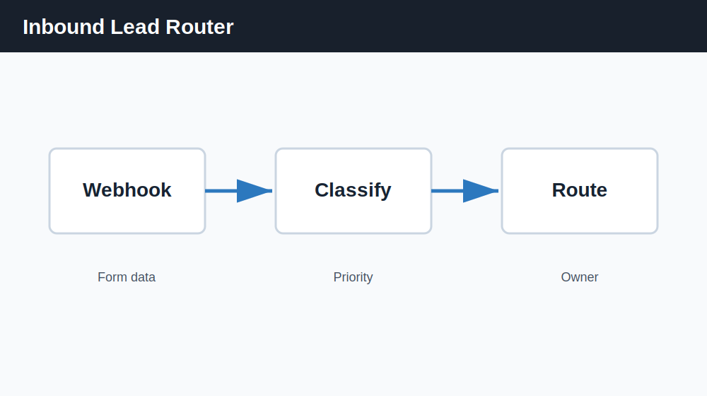
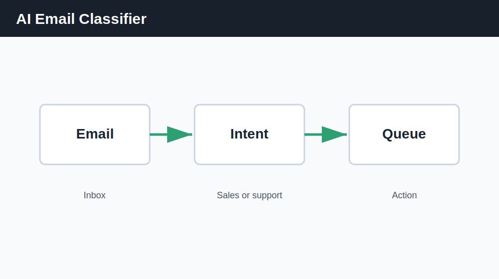

# n8n AI Automation Demos

Demo automation workflows using n8n, AI prompts and business logic for SMB use cases.

## Why it matters

Many SMB automation opportunities are not complex. They need clear workflow logic, clean inputs, human review and safe handling of data.

This repository provides simple n8n workflow examples that show how AI can support lead routing, email classification, CRM updates and content brief creation.

## What is included

- Inbound lead router workflow
- AI email classifier workflow
- Meeting summary to CRM workflow
- Content brief generator workflow
- Setup guide
- Use case documentation
- Safety and data handling guide
- Human review guidelines
- Workflow testing checklist
- Sample input files
- Sample output files
- Roadmap
- Changelog

## Documentation

- [How to import workflows](docs/how-to-import-workflows.md)
- [Workflow library](docs/workflow-library.md)
- [Safety and data handling](docs/safety-and-data-handling.md)
- [Human review guidelines](docs/human-review-guidelines.md)
- [Workflow testing checklist](docs/workflow-testing-checklist.md)
- [AI automation use case scoring](docs/use-case-scoring.md)
- [Roadmap](ROADMAP.md)
- [Changelog](CHANGELOG.md)

## Examples

- [Sample inputs](examples/sample-inputs/)
- [Sample outputs](examples/sample-outputs/)

## Use case

Use these demos as starting points for SMB automation conversations, internal prototypes or client workshops.

## Example

An inbound lead form can trigger a workflow that:

1. Reads the lead details.
2. Classifies the lead by intent and urgency.
3. Assigns a sales owner.
4. Sends a notification for human review.

## Workflow mockups

## How to use

1. Import one JSON file from the `workflows` folder into n8n.
2. Replace placeholder nodes with your tools.
3. Add your own credentials inside n8n, not in the JSON file.
4. Test with sample data first.
5. Review all AI-generated output before using it with customers.

## Business value

These demos help teams identify low-risk automation opportunities, reduce manual sorting and create repeatable workflows for common business operations.

## Disclaimer

These workflows are demos.

They are not production-ready systems and should not be used with real business data without reviewing credentials, privacy, permissions, error handling, human approval steps and compliance requirements.

AI-generated outputs should be reviewed by a human before being used in customer-facing, CRM or operational workflows.

## Author

Built by Mohammed Teto  
AI, Automation & LLM Visibility Consultant  
Casablanca, Morocco  
Website: https://mohammedteto.com
